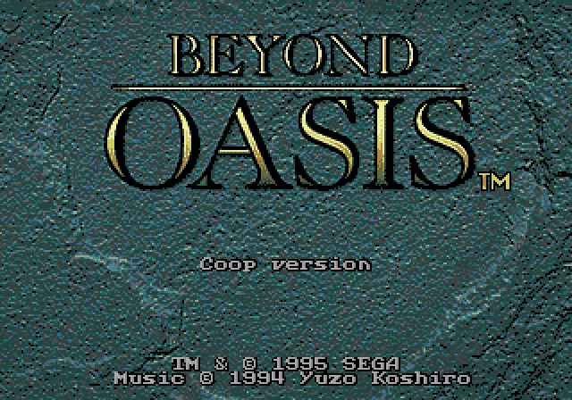
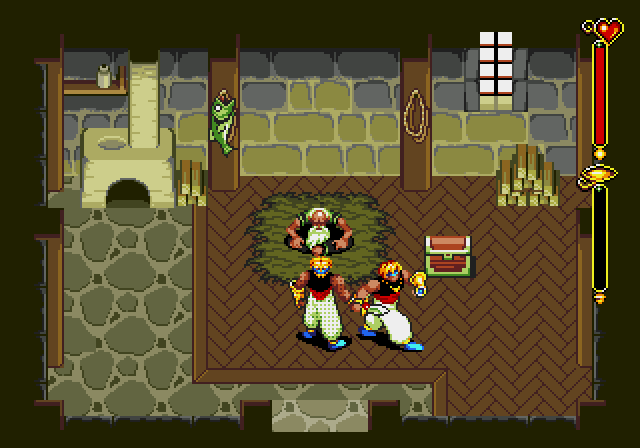
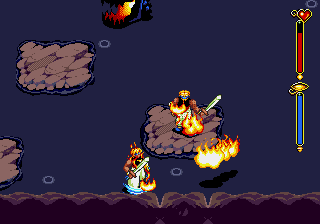

# Beyond Oasis Coop

Русский | [English](README.md)

Экспериментальный ROM-патч для игры **Beyond Oasis** на Sega Mega Drive / Genesis, добавляющий кооператив для двух игроков. Этот выпуск посвящён локальной игре и исправлениям по результатам аудита памяти P2.







## Как работает кооператив

- Два независимо управляемых героя: движение, прыжки и атаки.
- P2 использует исходные спрайты героя с затемнением цветов на 25%, без метки P2.
- P2 не теряет здоровье, но реагирует на удары: его действия прерываются.
- Сюжет, диалоги, инвентарь, подбор предметов и духи остаются у P1. Камера следует за P1; вышедший за экран P2 переносится ближе. Переходы между комнатами общие.
- Призванные духи считают P2 союзником: Dytto, Джин, Shade и Bow не выбирают и не атакуют его в проверенных путях выбора целей и атак.
- Оружие P2 повторяет текущее оружие P1. Прочность и боеприпасы общие.
- Прямые атаки героев не повреждают друг друга. Исходные опасности, включая бомбы, сохраняют свою логику; неуязвимость P2 продолжает действовать.
- Во время сюжетных диалогов и переходов к графике меню P2 временно скрывается и останавливается: оригинальная игра использует этот банк видеопамяти для текста. После возвращения его графика загружается заново.

**Это прототип, а не проверенная кооперативная версия всей кампании.** Новые сетевые испытания этого выпуска не проводились. Проверены отдельные состояния предыдущих сборок; для дальнейшей игры рекомендуются новые состояния текущего выпуска.

## Исходный ROM

Нужен собственный оригинальный **Beyond Oasis (U)** размером 3 145 728 байт и с SHA-256:

```text
eb19bda4982366a2fd43d65ab8a7f9709d83a8cc902c14a682c088c16359c263
```

Поддерживается только этот дамп. Имя файла не важно, содержимое — важно. Патчер отклоняет несовпадающие файлы и не перезаписывает оригинал. В репозитории и архивах нет исходного или модифицированного игрового ROM.

## Запуск на любой платформе

ROM предназначен для **любого совместимого эмулятора Mega Drive / Genesis на любой платформе**, поддерживающего два порта контроллеров. Windows и RetroArch не являются требованиями самого ROM. Совместимость с каждым эмулятором отдельно не проверялась.

1. Примените `beyond-oasis-coop.bps` к поддерживаемому исходному ROM с помощью BPS-патчера для вашей платформы. Другой вариант — сборка через Python, описанная ниже.
2. Откройте полученный `Beyond Oasis Coop.bin` в эмуляторе.
3. Включите два стандартных трёхкнопочных контроллера Mega Drive и назначьте разные устройства двум портам.
4. Начните игру за P1; P2 появляется как боевой помощник.

### Проверенная конфигурация Windows (необязательно)

Тесты выполнялись с **RetroArch 1.22.2** и **Genesis Plus GX v1.7.4-coop1**. Полный архив включает это ядро, его полный исходный код и удобные скрипты Windows:

1. Запустите `Create-Coop-ROM.cmd` и выберите оригинальный ROM. Результат: `generated/Beyond Oasis Coop.bin`.
2. Установите RetroArch отдельно. Запустите `Play-Local.cmd` и выберите `retroarch.exe`.
3. В настройках ввода назначьте разные устройства портам 1 и 2.

Launcher выбирает включённое ядро. В других совместимых эмуляторах ROM открывается напрямую. Маленький архив патчера не включает ядро и launcher. RetroArch не изменён и не включён в архив; ядро содержит ранее внесённые изменения сериализации состояния. См. [уведомления о сторонних компонентах](THIRD_PARTY_NOTICES.md).

### Патчер для Linux

Установите Python 3 через пакетный менеджер вашего дистрибутива и выполните в папке распакованного релиза:

```bash
bash create-coop-rom.sh "/путь/к/Beyond Oasis.bin"
```

Без аргумента `bash create-coop-rom.sh` откроет выбор файла, если в графической сессии доступен Zenity или KDialog; иначе предложит ввести путь в терминале. Отмена выбора завершает скрипт без создания ROM. Вторым аргументом можно задать выходной путь. По умолчанию результат сохраняется рядом со скриптом: `generated/Beyond Oasis Coop.bin`. Пробелы в путях поддерживаются. Дополнительные пакеты Python не нужны.

Можно также выполнить `chmod +x create-coop-rom.sh` и запускать `./create-coop-rom.sh`. Windows DLL ядра на Linux не требуется: откройте полученный ROM в своём совместимом эмуляторе.

### Другие варианты ROM

Существуют дампы разных регионов, ревизий, с дополнительными заголовками и лишними данными. Этот выпуск не пытается угадать их формат и не применяет патч к другой ревизии. Проверить SHA-256 в PowerShell:

```powershell
Get-FileHash -LiteralPath "C:\Games\Beyond Oasis.bin" -Algorithm SHA256
```

### Игра через интернет

Для сети предполагается использование netplay эмулятора. У обоих игроков должны совпадать ROM, ядро и настройки. В этом выпуске подтверждены локальные тесты и воспроизводимость состояния; не заявляются проверенная 30-минутная сетевая сессия, измеренная задержка или совместимость любых версий эмуляторов.

## Сборка из исходников

Для сборки нужен Python 3; его можно использовать на Windows, macOS и Linux. При применении BPS отдельным патчером Python не требуется.

```text
python src/build.py --rom "path/to/original.bin"
```

Используется закреплённый `src/payload.bin`. Для пересборки ассемблерного кода нужен **vasm 1.9d**:

```text
python src/build.py --rom "path/to/original.bin" --assembler "path/to/vasmm68k_mot"
```

Сборщик проверяет оригинал, payload, исходные инструкции и итоговый SHA-256. Ожидаемый результат:

```text
665f32f2f400dd9a3f8a4123a37af7530bb206014efbced6fd4fb45bbfbf41fb
```

Создание BPS после сборки:

```text
python src/bps.py --rom "path/to/original.bin"
```

При намеренном изменении исходников разработчику нужно обновить адреса адаптеров в `src/target-routes.json` и закреплённые хеши payload/ROM. Сборщик отклоняет незакреплённые изменения.

## Проверки и ограничения

Этот выпуск прошёл **172 проверки**, включая 60 проверок духов. Атака Джина на P2 воспроизведена на прежнем ROM; на тех же условиях исправленный ROM проходит тест. Проверены исходный выбор целей, маски столкновений, таблицы атак духов, 600 обычных кадров каждого призванного духа, восстановление состояния, локальное управление, общее оружие, независимый урон, реакции на удары, первая сюжетная битва, огонь и сценарии аудита памяти. Видеопамять проверялась на 3020 кадрах семи ограниченных сценариев.

Подробности: [отчёт](REPORT.md), [технические заметки](RESEARCH.md), JSON в `reports/`. Для тестов нужны Python, NumPy/Pillow, а для native fixtures — vasm. Некоторые сценарии требуют частных игровых состояний, не включённых в архивы. Полная кампания, каждый враг, все режимы графики и сетевые сессии пока не проверены.

## Сообщение об ошибке

Укажите выпуск и хеш ROM, версии эмулятора/ядра, комнату или противника, действия игроков и приложите скриншот. Особенно полезна короткая последовательность воспроизведения. Не прикладывайте игровой ROM. Если используется старое состояние, укажите сборку, в которой оно создано.

## Авторы и распространение

Beyond Oasis и оригинальные материалы принадлежат соответствующим правообладателям. Это неофициальный фанатский проект. Распространяйте патч или патчер, а не ROM. Лицензии стороннего эмулятора и полный исходный код включённого модифицированного ядра сохранены. Проект не меняет лицензии оригинальных игровых материалов и стороннего кода: [THIRD_PARTY_NOTICES.md](THIRD_PARTY_NOTICES.md).
